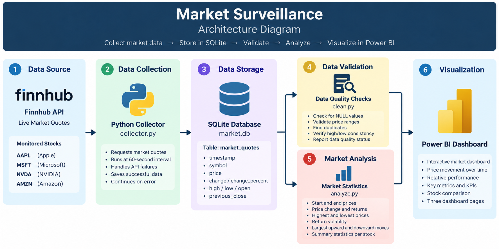
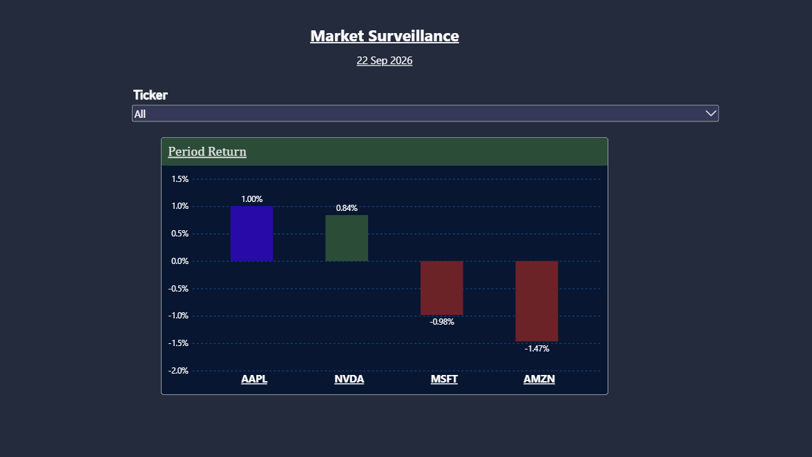
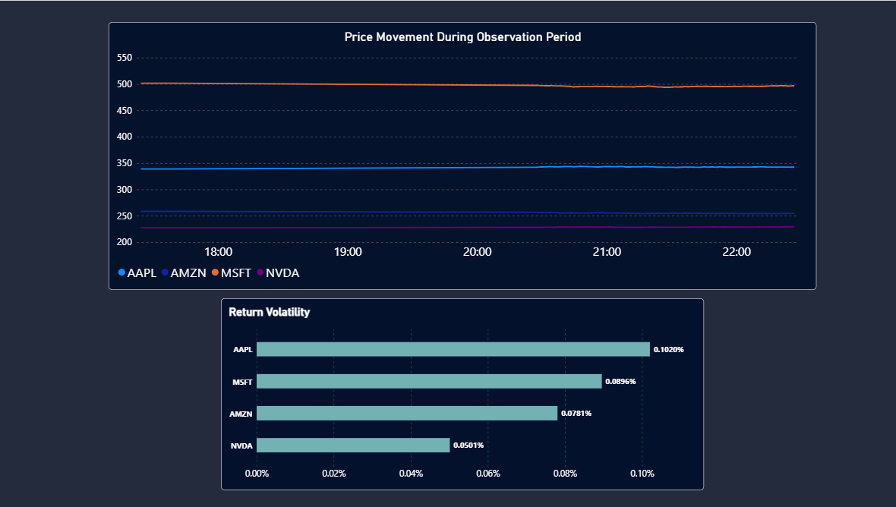

# Market Surveillance

A compact end-to-end market data pipeline built to answer a simple question:

> **What happened in the market during our monitored period?**

Market Surveillance collects market quotes from the Finnhub API, stores them in a SQLite database, validates the collected data, analyzes price movement and volatility with Python, and presents the results through an interactive Power BI dashboard.

The project monitors four U.S. equities:

- **AAPL** — Apple
- **MSFT** — Microsoft
- **NVDA** — NVIDIA
- **AMZN** — Amazon

The final dataset contains **515 market observations** collected during the monitoring period.

The project was intentionally designed as a small, practical data engineering and analytics workflow rather than a large distributed system.

---

## What the Project Does

```text
Finnhub API
     ↓
Python Data Collection
     ↓
SQLite Database
     ↓
Data Quality Validation
     ↓
Market Analysis
     ↓
Power BI Dashboard

---

## Architecture

The Market Surveillance pipeline follows a simple end-to-end data workflow:



The architecture separates the pipeline into distinct stages:

- **Data Source** — Finnhub provides market quotes for the monitored stocks.
- **Data Collection** — Python retrieves and records the observations.
- **Data Storage** — SQLite provides persistent relational storage.
- **Data Validation** — `clean.py` checks the collected data for quality issues.
- **Market Analysis** — `analyze.py` calculates returns, volatility, price statistics, and market movements.
- **Visualization** — Power BI transforms the collected data into an interactive dashboard.

This separation makes it possible to inspect each stage independently while keeping the overall pipeline simple and reproducible.

---

## Data Collection

Market data is collected using Python and the Finnhub API.

The collector monitors four stocks:

| Symbol | Company |
|---|---|
| AAPL | Apple |
| MSFT | Microsoft |
| NVDA | NVIDIA |
| AMZN | Amazon |

The collection process is configured to request quotes at approximately **60-second intervals**.

For each successful observation, the collector records:

- Timestamp
- Stock symbol
- Current price
- Price change
- Percentage change
- High
- Low
- Open
- Previous close

### Collection Reliability

The collector was designed so that a failed API request for one stock does not terminate the entire collection process.

Instead, the failure is recorded and the collector continues with the remaining stocks.

For example:

```text
Cycle result: 4 saved | 0 failed

This approach allows the pipeline to retain successful observations even when an individual API request encounters a temporary problem.

Collector Implementation

The main collection logic is contained in:
src/collector.py

The collector writes successful observations directly into the SQLite database, creating a persistent record of the monitoring period.

## Data Storage

The collected market observations are stored in a local **SQLite** database.

- **Database Path:** `data/database/market.db`
- **Primary Table:** `market_quotes`

### Database Schema

| Column | Description |
| :--- | :--- |
| `id` | Unique record identifier |
| `timestamp` | Time at which the quote was collected |
| `symbol` | Stock ticker symbol |
| `price` | Current observed price |
| `change` | Price change |
| `change_percent` | Percentage price change |
| `high` | API-reported high |
| `low` | API-reported low |
| `open` | Opening price |
| `previous_close` | Previous closing price |

> Each successful API response is converted into a database record and stored using parameterized SQL queries.

---

### Why SQLite?

SQLite was chosen because the project is intentionally small and local. It provides:

* **Relational Structure:** Standard SQL querying and relational schema integrity
* **Persistence:** Reliable local disk storage across runs
* **Zero Configuration:** Self-contained engine with no separate database server required
* **Portability:** The entire database lives in a single, easily movable file

For the scale of this project, a full cloud database or distributed storage system would add infrastructure complexity without providing meaningful benefit. The database serves as the clean persistence layer bridging data collection and downstream analysis.

---

## Data Quality

Before performing any market analysis, the collected dataset passes through a dedicated data-quality validation step.

The validation logic is contained in:

```text
src/clean.py

The purpose of clean.py is to inspect the collected data and identify potential problems before the data is used for analysis or visualization.

Quality Checks

The validation process checks for:

- Total number of records
- Records collected for each stock
- Missing (NULL) values
- Invalid prices
- High/low inconsistencies
- Prices outside the reported high/low range
- Duplicate timestamp and symbol combinations
- Overall timestamp range

The validation script is intentionally read-only. It inspects the database but does not modify or delete any records.

Validation Result

The final dataset contained 515 observations:

| Symbol | Observations |
| AAPL	| 129 |
| AMZN |	130 |
| MSFT	| 128 |
| NVDA	 | 128 |
| Total	|515 |

The validation process found:

- 0 NULL values
- 0 invalid prices
- 0 high/low inconsistencies
- 0 prices outside the reported range
- 0 duplicate observations

The resulting status was:

DATA LOOKS CLEAN

This validation step creates a clear boundary between data collection and data analysis, reducing the risk of analyzing corrupted or inconsistent observations.

---

---

## Market Analysis

After the dataset passes validation, the next stage is market analysis.

The analytical logic is contained in:

```text
src/analyze.py

The script processes the collected observations for each stock and calculates a set of descriptive market metrics.

Metrics Calculated

For each stock, the analysis calculates:

- Number of observations
- Starting price
- Ending price
- Lowest observed price
- Highest observed price
- Average price
- Absolute price change
- Percentage return
- Return volatility
- Largest upward move
- Largest downward move
- Largest absolute move

Return Calculation

The period return measures the change between the first and last observed prices:

Period Return =
(Ending Price - Starting Price)
───────────────────────────────
       Starting Price

Volatility

Return volatility is calculated from the consecutive price returns observed during the monitoring period.

For each observation:

Return =
(Current Price - Previous Price)
────────────────────────────────
        Previous Price

        The standard deviation of these consecutive returns is then used as the observed return volatility.

This volatility measure describes price variation during the collected observation period and is not annualized.

Analysis Run

The complete analytical output can be seen below.

Terminal output from python src/analyze.py.

---

## Analysis Results

The completed monitoring period produced different price movements across the four monitored stocks.

| Stock | Starting Price | Ending Price | Price Change | Period Return | Volatility |
|---|---:|---:|---:|---:|---:|
| AAPL | $338.98 | $342.38 | +$3.40 | +1.00% | 0.1020% |
| AMZN | $258.45 | $254.66 | -$3.79 | -1.47% | 0.0781% |
| MSFT | $501.61 | $496.68 | -$4.93 | -0.98% | 0.0896% |
| NVDA | $227.38 | $229.29 | +$1.91 | +0.84% | 0.0501% |

### What the Dataset Shows

During the monitored period:

- **AAPL** finished above its starting price, with a period return of **+1.00%**.
- **NVDA** also finished above its starting price, with a period return of **+0.84%**.
- **MSFT** finished below its starting price, with a period return of **-0.98%**.
- **AMZN** finished below its starting price, with a period return of **-1.47%**.

The calculated return volatility values ranged from **0.0501% to 0.1020%** across the four stocks.

These results describe the specific observation period captured by this project and should not be interpreted as a longer-term assessment of the stocks.

### Largest Observed Moves

The analysis also identifies the largest individual upward and downward movements between consecutive observations.

| Stock | Largest Upward Move | Largest Downward Move |
|---|---:|---:|
| AAPL | +0.9706% | -0.1863% |
| AMZN | +0.1807% | -0.6346% |
| MSFT | +0.1394% | -0.8353% |
| NVDA | +0.3694% | -0.1050% |

This provides a more granular view of the movement captured by the collector rather than relying only on the beginning and ending prices.

---

## Power BI Dashboard

The final stage of the project is an interactive Power BI dashboard built from the validated market dataset.

The dashboard is divided into three pages, with each page answering a different analytical question:

1. **Market Surveillance** — What happened overall?
2. **Price Movement** — How did prices move during the observation period?
3. **Relative Performance** — How did the stocks move relative to their own starting prices?

---

### Page 1 — Market Surveillance

The main overview page provides a high-level view of the monitored stocks.

It includes:

- Observation period
- Stock ticker filter
- Period return comparison
- Cross-stock performance



*Power BI — Market Surveillance overview.*

The period return visualization provides a quick comparison of the change between each stock's first and last observed prices.

---

### Page 2 — Price Movement

The second page focuses on the actual price movement recorded throughout the observation period.

It includes:

- Price movement over time
- Individual stock price series
- Observed return volatility



*Power BI — Price Movement page.*

The time-series visualization uses the actual observation timestamp rather than a yearly date hierarchy, allowing the intraday movement captured by the collector to remain visible.

The volatility chart provides a second perspective by showing the variation in consecutive observed returns for each stock.

---

### Page 3 — Relative Performance

The third page compares the four stocks on a common scale.

Because the stocks have very different absolute prices, their prices are normalized so that:

```text
Starting Price = 100

Each subsequent observation is expressed relative to that starting point.

Power BI — Relative Performance page.

This makes it possible to compare the direction and magnitude of movement across stocks without the different dollar price levels dominating the visualization.

Dashboard Design

The three pages are intentionally separated by analytical purpose:

Market Surveillance
        ↓
Overall performance

Price Movement
        ↓
Intraday price behavior

Relative Performance
        ↓
Comparable movement from a common baseline

Together, the pages provide a progression from overview → movement → comparison.

---

## DAX & Data Model

The Power BI model is built around the `market_quotes` table imported from the SQLite dataset.

The table contains one observation for each successful stock quote collected by the Python pipeline.

### Core Measures

Several DAX measures were created to reproduce the Python analysis inside Power BI.

#### Total Observations

```DAX
Total Observations =
COUNTROWS(market_quotes)

Counts the number of market observations currently visible in the report context.

Starting Price

Starting Price =
VAR FirstTimestamp =
    MIN(market_quotes[timestamp])
RETURN
    CALCULATE(
        MAX(market_quotes[price]),
        market_quotes[timestamp] = FirstTimestamp
    )

Returns the first observed price within the current filter context.

Ending Price

Ending Price =
VAR LastTimestamp =
    MAX(market_quotes[timestamp])
RETURN
    CALCULATE(
        MAX(market_quotes[price]),
        market_quotes[timestamp] = LastTimestamp
    )

Returns the final observed price within the current filter context.

Period Return

Period Return =
DIVIDE(
    [Ending Price] - [Starting Price],
    [Starting Price]
)

Price Change

Price Change =
[Ending Price] - [Starting Price]

Calculates the absolute price difference between the beginning and end of the observation period.

Return Volatility

The Power BI model also calculates volatility from consecutive observations.

The calculation:

1 Identifies the previous observation for each stock.
2 Calculates the return between the current and previous prices.
3 Collects those consecutive returns.
4 Calculates their sample standard deviation.

This reproduces the volatility concept used in the Python analysis while allowing the value to respond dynamically to Power BI filters.

Relative Performance

The Relative Performance page uses a normalized price measure.

Each stock's first observed price is treated as:

100

Subsequent prices are then expressed relative to that starting value.

Conceptually:

Normalized Price =
(Current Price / Starting Price) × 100

This allows stocks with different absolute price levels to be compared on the same visual scale.

Data Flow into Power BI

SQLite
   ↓
Python / Pandas
   ↓
Power BI
   ↓
Power Query
   ↓
market_quotes
   ↓
DAX Measures
   ↓
Dashboard Visuals

The Python layer therefore handles the collection and initial analysis, while DAX provides interactive calculations inside the Power BI report.

---

## Project Structure

The repository is organized to keep data, source code, documentation, dashboards, and tests separated.

```text
Market-Surveillance/
│
├── images/
│   ├── architecture.png
│   ├── dataflow.png
│   ├── collector.png
│   ├── clean.png
│   ├── analysis.png
│   ├── powerbi_overview.png
│   ├── powerbi_price_movement.png
│   └── powerbi_relative.png
│
├── config/
│
├── data/
│   ├── database/
│   │   └── market.db
│   ├── processed/
│   └── raw/
│
├── docs/
│
├── notebooks/
│
├── powerbi/
│
├── src/
│   ├── analyze.py
│   ├── clean.py
│   ├── collector.py
│   └── database.py
│
├── tests/
│   └── historical_test.py
│
├── .env
├── .gitignore
└── README.md

Directory Roles

| Directory / File   | Purpose                                     |
| ------------------ | ------------------------------------------- |
| `src/`             | Core Python pipeline code                   |
| `src/collector.py` | Collects market data from Finnhub           |
| `src/database.py`  | Handles SQLite database operations          |
| `src/clean.py`     | Performs data-quality validation            |
| `src/analyze.py`   | Performs market analysis                    |
| `data/database/`   | Local SQLite database                       |
| `data/raw/`        | Raw data storage area                       |
| `data/processed/`  | Processed data storage area                 |
| `powerbi/`         | Power BI project assets                     |
| `tests/`           | Testing scripts                             |
| `docs/`            | Supporting documentation                    |
| `notebooks/`       | Exploratory analysis and experiments        |
| `images/`          | README screenshots and architecture diagram |
| `config/`          | Configuration-related files                 |
| `.env`             | Local environment variables                 |
| `.gitignore`       | Files and directories excluded from Git     |

The repository structure separates application logic, data, visualization, and documentation, making the project easier to navigate and extend.

---

## Design Decisions

The project was intentionally designed around simplicity, reliability, and practical data engineering rather than unnecessary infrastructure.

### Why SQLite?

SQLite was selected as the database because the project deals with a relatively small dataset and does not require a database server.

It provides:

- Relational data storage
- SQL querying
- Persistent records
- Minimal setup
- Easy local development

For this project's scale, SQLite provides the required functionality without introducing unnecessary infrastructure.

### Why Python?

Python serves as the main processing layer because it can handle the complete collection and analysis workflow.

It is used for:

- API communication
- Data collection
- Database interaction
- Data validation
- Statistical analysis
- Preparing data for Power BI

Keeping these tasks within Python also makes the pipeline easy to reproduce locally.

### Why Power BI?

Python is well suited to programmatic collection and analysis, while Power BI provides an interactive environment for exploring the resulting dataset.

Using both tools separates the workflow into two complementary roles:

```text
Python
Collection + Validation + Analysis

              ↓

Power BI
Interactive Analysis + Visualization

This also allows the analytical calculations to be reproduced interactively through DAX.

Why Separate Collection, Validation, and Analysis?

The project deliberately separates these responsibilities into different scripts:

collector.py
     ↓
clean.py
     ↓
analyze.py

This separation makes the pipeline easier to understand, debug, and extend.

For example, a data-quality problem can be investigated independently without modifying the collection logic.

Why Handle API Failures Per Stock?

Market data collection depends on an external API, so individual requests can fail.

The collector therefore handles failures at the stock level rather than terminating the entire collection process.

This means that if one request fails, successful observations from other stocks can still be retained.

The approach favors partial successful data collection over total pipeline failure.

Why Not Use Kafka, Spark, Airflow, or Other Distributed Tools?

The project was intentionally kept small.

The objective was to demonstrate a complete working data pipeline rather than introduce distributed technologies that are unnecessary for the size of the dataset.

Technologies such as Kafka, Spark, or Airflow could become appropriate in a larger production system with higher data volumes, more complex orchestration requirements, or multiple downstream consumers.

For this project, the simpler architecture keeps the focus on the core workflow:

Collect → Store → Validate → Analyze → Visualize

---

## Limitations

This project was built as a practical market-data engineering and analytics project, so there are several limitations to the dataset and implementation.

### API Limitations

The project depends on the Finnhub API for market data.

The availability and accessibility of historical market-data endpoints depends on the API plan. During development, historical candle retrieval for the required testing period returned HTTP 403 responses under the available plan.

As a result, this project uses the observations successfully collected during the live collection period rather than attempting to reconstruct a longer historical dataset.

### Limited Observation Period

The final dataset contains approximately five hours of observations collected on September 22, 2026.

Therefore, the calculated returns and volatility describe this specific observation period rather than long-term market behavior.

The results should not be interpreted as representative of the stocks' performance over a longer period.

### Small Dataset

The dataset contains 515 observations across four stocks:

- AAPL
- AMZN
- MSFT
- NVDA

This is sufficient for demonstrating the pipeline and Power BI analysis, but it is not large enough to demonstrate the performance characteristics of a production-scale data platform.

### SQLite Storage

SQLite is appropriate for the scale of this project but is not designed for high-concurrency production workloads.

A larger implementation could use a hosted relational database or data warehouse depending on the requirements.

### API Dependency

The collector depends on an external service.

Network failures, API timeouts, rate limits, unavailable endpoints, or changes to the provider's API can affect data collection.

The collector handles individual request failures by skipping unsuccessful observations, but this necessarily means that some collection cycles may contain fewer records than expected.

---

## Future Development

The current project establishes the complete pipeline from external market data to an interactive analytical dashboard.

Several extensions could take the project further.

### Automated Data Collection

The collection process could be scheduled automatically rather than being started manually.

A future implementation could use:

- GitHub Actions
- Windows Task Scheduler
- Apache Airflow

The appropriate orchestration tool would depend on the frequency and complexity of the pipeline.

### Cloud Database

SQLite could be replaced with a hosted PostgreSQL database or cloud data warehouse.

This would allow the project to move from a local analytical workflow toward a remotely accessible data platform.

### Larger Stock Universe

The collector could be extended to monitor a larger basket of stocks across multiple sectors.

For example:

```text
Technology
Healthcare
Finance
Consumer
Energy

This would make sector-level comparisons possible.

Longer Historical Dataset

With access to an appropriate historical market-data source, the project could be extended to analyze:

Daily returns
Long-term volatility
Drawdowns
Rolling volatility
Moving averages
Correlations between stocks
Automated Power BI Refresh

A production-oriented version could connect the dashboard to a hosted data source and automatically refresh the analytical model after each successful pipeline run.

Additional Data Sources

The project could eventually combine market prices with other financial datasets such as:

Company fundamentals
Earnings
Financial statements
Economic indicators
Sector information

This would transform the project from a market-monitoring pipeline into a broader financial analytics platform.

---

## Project Status

**Status: Complete**

The current version of the project successfully demonstrates an end-to-end market-data pipeline:

```text
Finnhub API
     ↓
Python Collection
     ↓
SQLite Storage
     ↓
Data Quality Validation
     ↓
Python Analysis
     ↓
Power BI Data Model
     ↓
Interactive Dashboard

The project successfully collected and validated 515 market observations across four stocks and transformed them into a three-page Power BI dashboard.

The project is intentionally complete in its current form rather than being extended indefinitely. Future improvements are documented above as potential directions rather than unfinished requirements.

Technologies Used
Data Collection & Processing
Python
Finnhub API
SQLite
SQL
Pandas
Python statistics
Data Quality & Analysis
Python
SQL
Statistical analysis
Return calculations
Volatility calculations
Business Intelligence
Microsoft Power BI
Power Query
DAX
Data modeling
Development Tools
Git
GitHub
Visual Studio Code
Python virtual environment

Key Skills Demonstrated

This project demonstrates practical experience with:

API-based data ingestion
Relational database design
SQL querying
ETL pipeline development
Data-quality validation
Exception handling
Statistical analysis
Financial market metrics
DAX measure development
Power BI data modeling
Interactive dashboard design
Git/GitHub project organization

The project also demonstrates the separation of responsibilities across a data workflow:

INGEST
  ↓
STORE
  ↓
VALIDATE
  ↓
ANALYZE
  ↓
VISUALIZE

Author

beo-wu1f (Rishi Kant)

Built as a practical data engineering and business intelligence project.